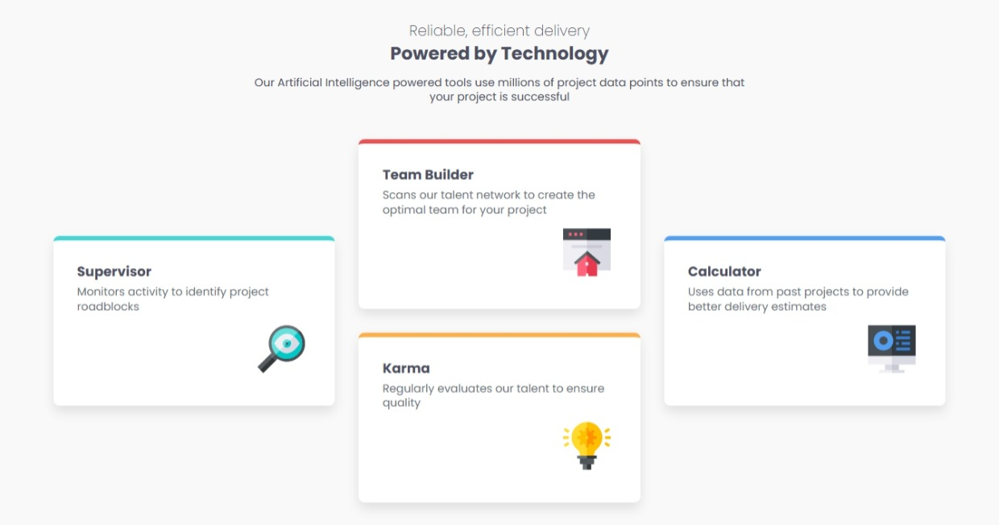

# Frontend Mentor - Four card feature section solution

This is a solution to the [Four card feature section challenge on Frontend Mentor](https://www.frontendmentor.io/challenges/four-card-feature-section-weK1eFYK). Frontend Mentor challenges help you improve your coding skills by building realistic projects.

## Table of contents

- [Overview](#overview)
  - [Screenshot](#screenshot)
  - [Links](#links)
- [My process](#my-process)
  - [Built with](#built-with)
  - [What I learned](#what-i-learned)
- [Author](#author)

## Overview

### The challenge

Users should be able to:

- View the optimal layout for the site depending on their device's screen size

### Screenshot



### Links

- Solution URL: [https://github.com/ChasingCloudss/Four-Card-Feature](https://github.com/ChasingCloudss/Four-Card-Feature)
- Live Site URL: [https://glittery-hamster-4badaf.netlify.app/](https://glittery-hamster-4badaf.netlify.app/)

## My process

### Built with

- Semantic HTML5 markup
- CSS custom properties
- Flexbox
- CSS Grid
- Mobile-first workflow

### What I learned

I struggled creating the colored accents on the cards. However, I figured it out by parsing a value to the `border-top` property of the `li` tag.

See the code snippet below:

```css
li {
  overflow: hidden;
  border-radius: 0.5rem;
  border-top: 0.4rem solid var(--orange);
  background-color: var(--white);
}
```

## Author

- Github - [https://github.com/ChasingCloudss/Four-Card-Feature](https://github.com/ChasingCloudss/Four-Card-Feature)
- Frontend Mentor - [@ChasingCloudss](https://www.frontendmentor.io/profile/ChasingCloudss
